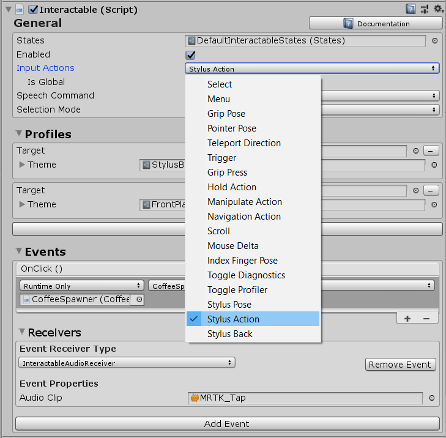
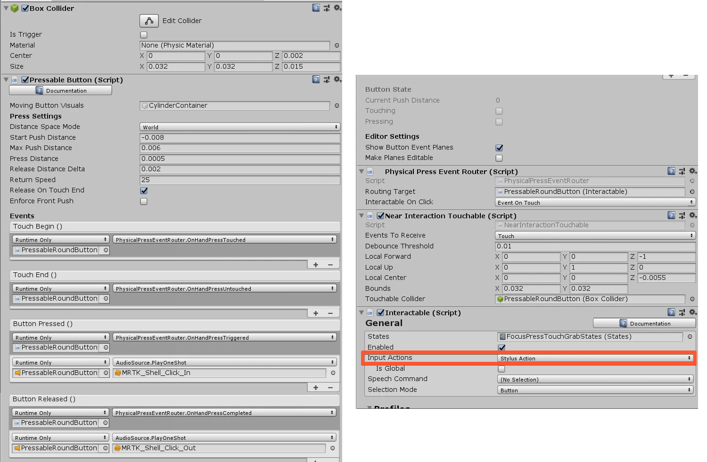

# Buttons & Interaction Components

	

If you are not familar with the Interactable Component, first have a look here [Interactable Component](https://microsoft.github.io/MixedRealityToolkit-Unity/Documentation/README_Interactable.html).

	

## How to configure Interactable Component so it reacts to Stylus Button Interactions

Select the `Stylus Action` from the Input Actions list so it triggers ONLY on the ACTION (Front) Button. That's all :slightly_smiling_face: When you select the `Stylus Back` it will trigger when you press the BACK Button.

> :information_source: If you want it to trigger as well with e.g. Hand Gestures then have a look here ([Using Stylus with other Controllers](STYLUS_CONTROLLER.md))

	

## How to configure Pressable Buttons to work by pressing it with the Stylus Tip 

	
	

A good reference for the pressable buttons is [MRTK Pressable Buttons](https://microsoft.github.io/MixedRealityToolkit-Unity/Documentation/README_Button.html#collider-based-buttons-1)

Just change the Input Action to `Stylus Action` of the Interactable Compontent where the PressableButton is attached to. There you go :slightly_smiling_face:

	

## How to use Bounding Box and Manipulation Handler

	

Good news :slightly_smiling_face: You don’t have to change anything. 

Just have a look here to see how the MRTK Bounding Boxes work → [Bounding Box](https://microsoft.github.io/MixedRealityToolkit-Unity/Documentation/README_BoundingBox.html)