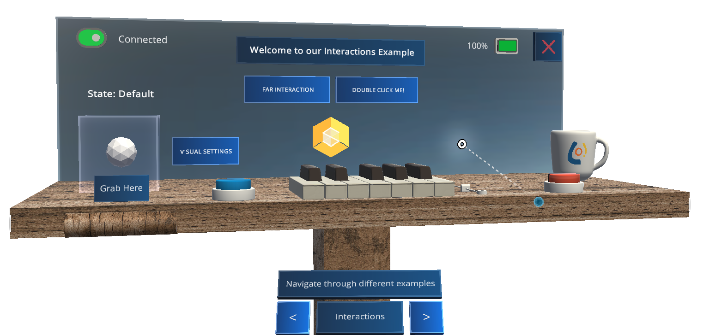
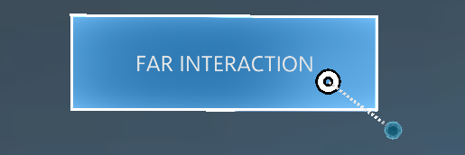
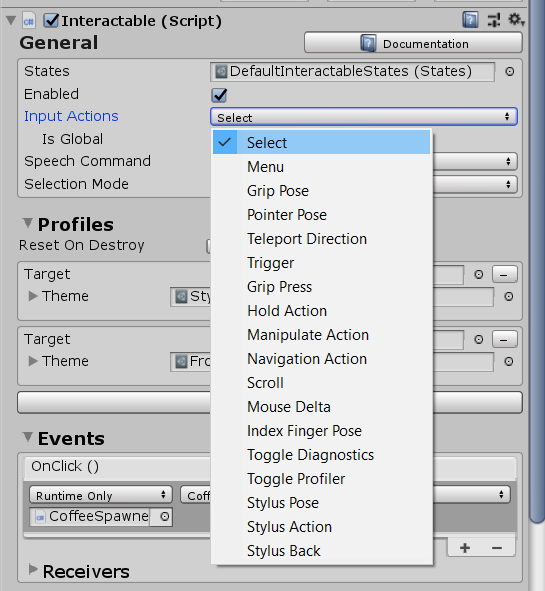
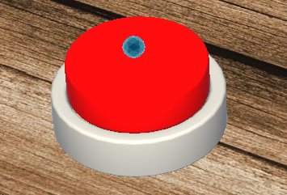
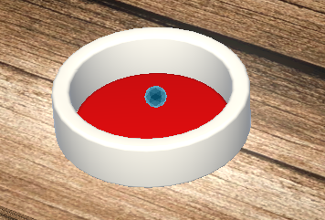

# Buttons & Interaction Components

	

If you are not familar with the Interactable Component, first have a look here [Interactable Component](https://docs.microsoft.com/de-de/windows/mixed-reality/mrtk-unity/features/ux-building-blocks/interactable).

	

## How to configure Interactable Component so it reacts to Stylus Button Interactions

Choose the `Select` from the Input Actions list so the interactable triggers on the (Front) Stylus Button. That's all :slightly_smiling_face: When you select the `Menu` it will trigger when you press the BACK Button.

	

## How to configure Pressable Buttons to work by pressing it with the Stylus Tip 

	
	

Good news! You don't have change anything. If the Input Action is set to `Select` of the Interactable Compontent where the PressableButton is attached to, it will react if the Stylus Tip presses that button. There you go :slightly_smiling_face:

A good reference for the pressable buttons is [MRTK Pressable Buttons](https://docs.microsoft.com/de-de/windows/mixed-reality/mrtk-unity/features/ux-building-blocks/button#collider-based-buttons-1)

## How to use Bounding Box and Manipulation Handler

	

Good news :slightly_smiling_face: You don’t have to change anything. 

Just have a look here to see how the MRTK Bounding Boxes work → [Bounding Box](https://docs.microsoft.com/de-de/windows/mixed-reality/mrtk-unity/features/ux-building-blocks/bounding-box)