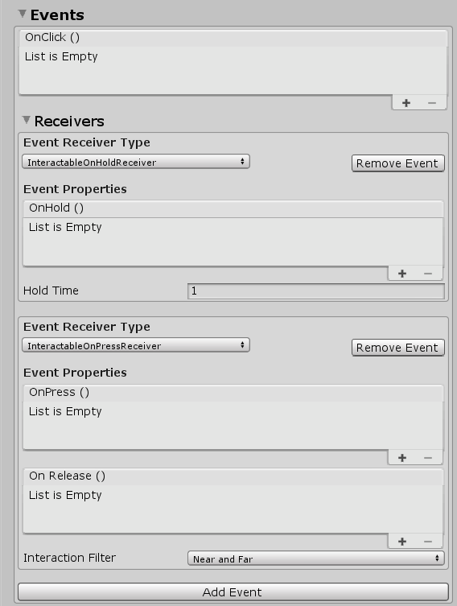

# OnClick, OnHold, OnPress, OnRelease + other

To react on click, hold, press, release or other events, just add the **Interactable** component. Then go to the Receivers section and click on “Add Event” and select the **Event Receiver Type** and add your events

	

