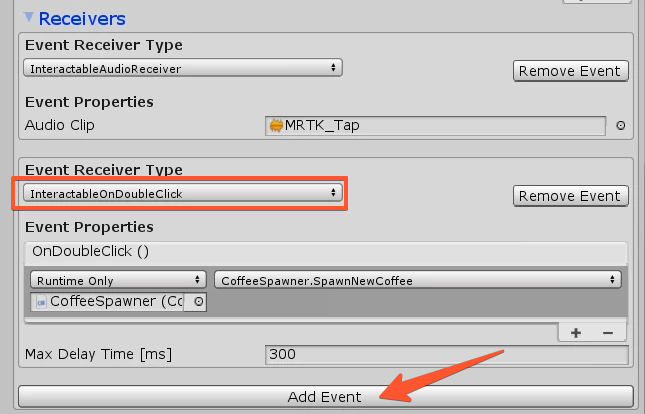

# OnDoubleClick

On an Interactable Component you can add our DoubleClick Event Reciever. You can further manipulate the Delay Time.

	

> :information_source: You can find such an example inside the Full Examples Scene (DoubleClickButton)

If you want to determine, on which BUTTON it should fire the DoubleClick event, you can set it on the Input Actions. A very good reference would be [Using Stylus with other Controllers](STYLUS_CONTROLLER.md) and [Buttons & Interaction Components](BUTTONS_INTERACTIONS.md).