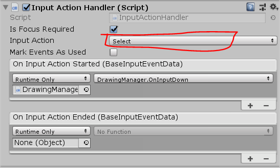

# OnInputDown/OnInputUp

Add the InputActionHandler to your GameObject and select the Input Action Type `Select` or `Stylus Back`.
Configure if you want the events to trigger only if the GameObject is focused.
<p align="center">
	
</p>

```csharp
public void OnInputDown(BaseInputEventData inputEventData)
{
	if (inputEventData.InputSource.SourceName.Contains("Stylus"))
	{
		// Stylus XR Input Down!!
		// do stuff...
	} else {
		// Other Controller Input Down
		// do stuff...
	}
}
```