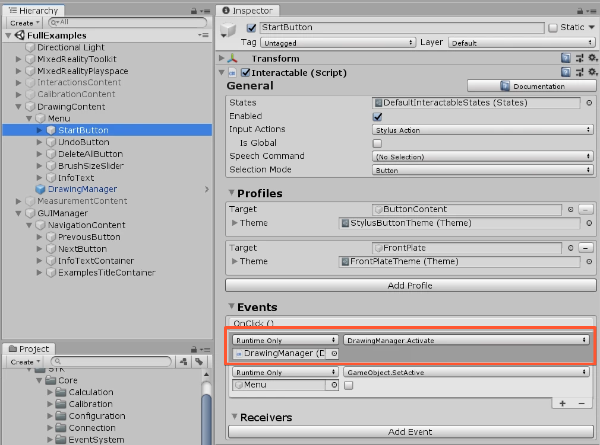
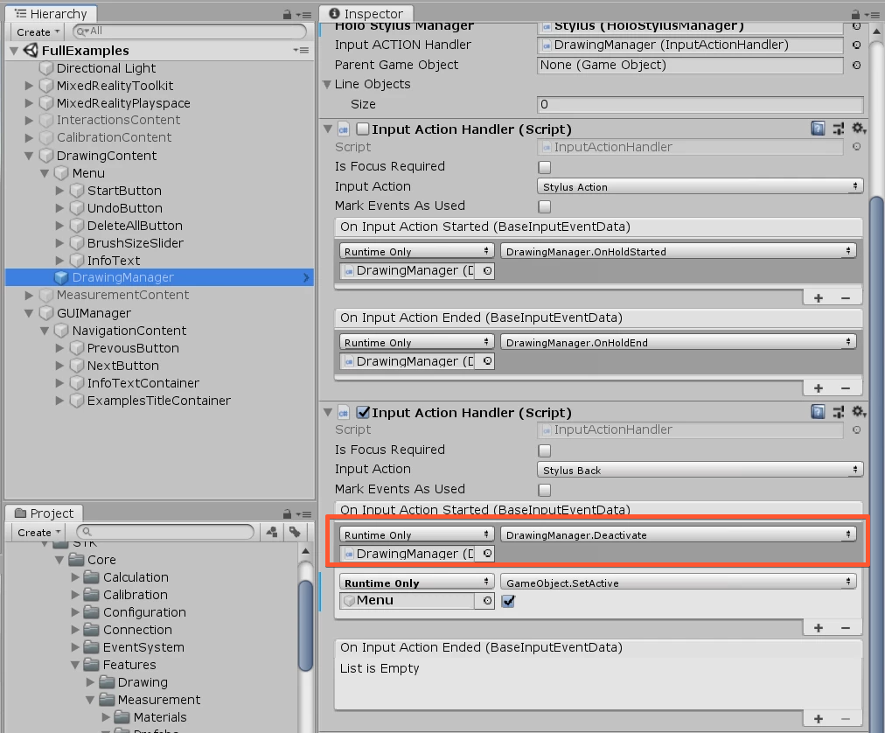

# Drawing

	

In order to use the Drawing Feature, you need the **DrawingManager** prefab. (can be found in `Holo-Light/STK/Core/Features/Drawing/Prefabs/DrawingManager.prefab`)

 
You just need to call the function Activate() to start with the drawing process. The ACTION Button Press triggers the drawing. 
**Example: Start the Drawing Process by pressing on a Button**

	

**Stop the Drawing Process by pressing the Stylus BACK**

	

**Activate()**

Starts the Drawing Process. After calling this function, the ACTION Button will trigger drawing lines.

**Deactivate()**

Stops the Drawing Process

**GetLines()**

Gets a List of GameObjects of the Lines.

**Undo()**

Removes last drawn Line

**DeleteAll()**

Removes all drawn Lines

**LineColor**

You can change the color of the Drawing, when changing the LineColor property