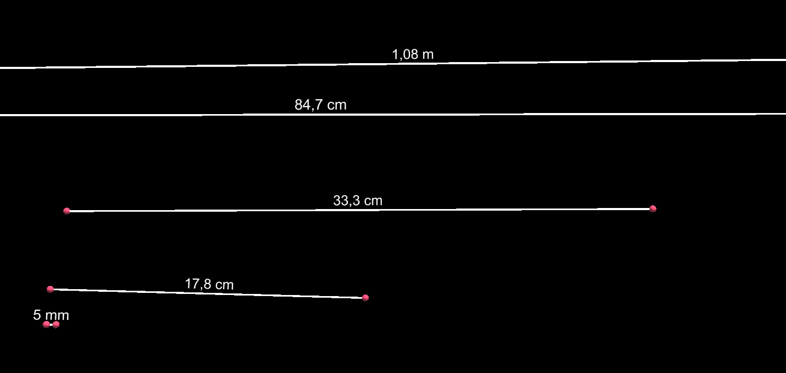
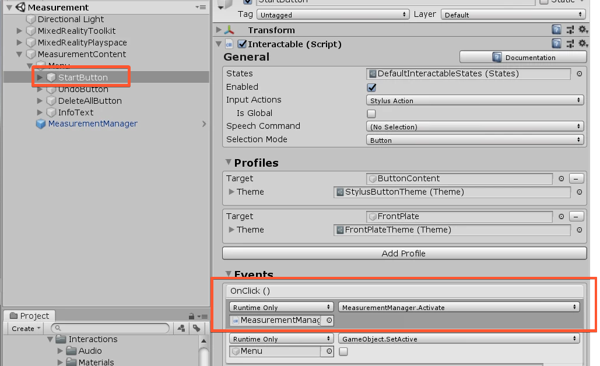
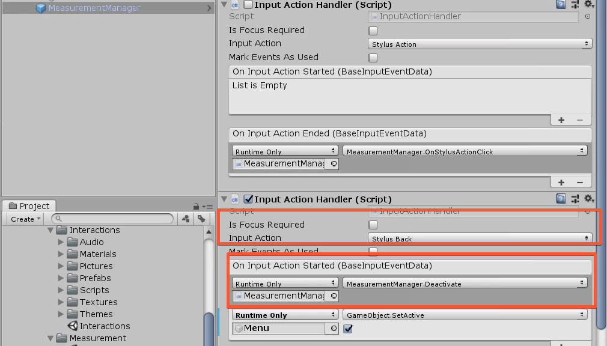

# Measurement

	

In order to use the Measurement Feature, you need the **MeasurementManager** prefab.(can be found in `Holo-Light/STK/Core/Features/Measurement/Prefabs/MeasurementManager.prefab`)

You just need to call the function Activate() to start with the measuring process. The first ACTION click will set the first point, the second click will set the second point. Then the line between these points will be drawn and the distance shown. That's all! :slightly_smiling_face:

By default, the Measurements are dynamic and can be resized and moved, after they are created. You can disable that, by unticking the "Dynamic Measurements" on the MeasurementManager Component. When a measurement is created it puts them as child of the **MeasurementsContainer**. If the MeasurementManager has no GameObject assigend for it, it creates a new GameObject and uses it as parent for all the created Measurements.

**Example: Start the Measurement by pressing on a Button**

	

**Stop the Measurement by pressing the Stylus Back**

	

**Activate()**

Starts the measurement process

**Deactivate()**

Stops the measurement process

**GetMeasurements()**

Gets a List of Measurements that were created

**Undo()**

Removes last Measurement Line

**DeleteAll()**

Removes all Measurement Lines

**SetMeasurementManipulation(bool enable)**

You can enable/disable the dynamic manipulation of the measuerments as you wish. It enables/disables the BoundingBoxes, BoxColliders and ManipulationHandlers Components of the children inside the MeasurementContainer.