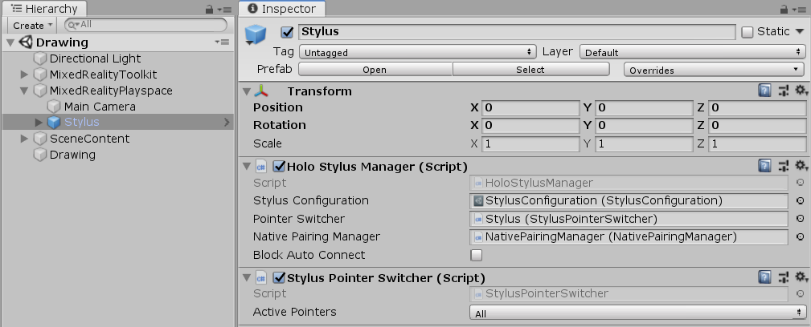
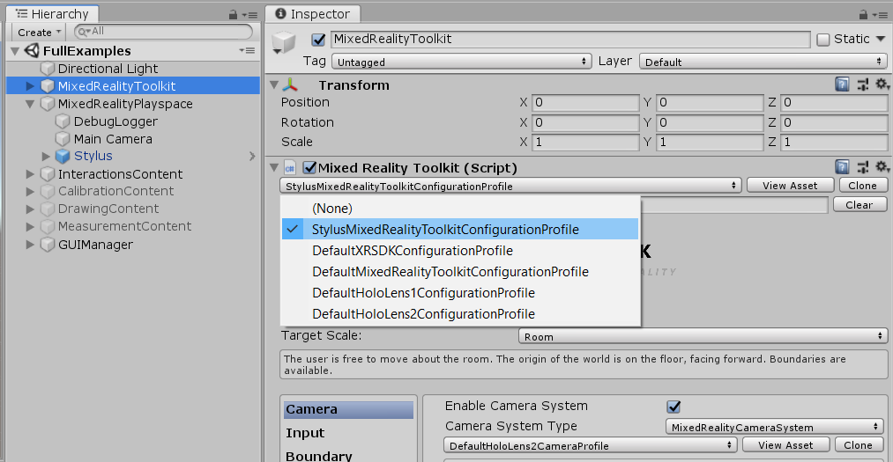
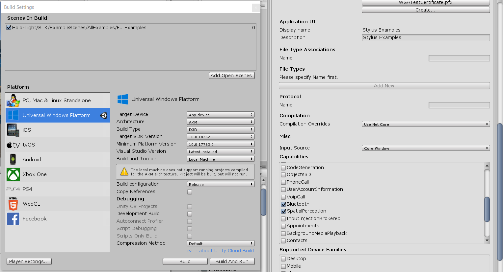

# Setup Scene for Stylus and Building

## Configure Scene and Project Settings
* The most important prefab is **Stylus** which is located in Holo-Light → STK →  Prefabs → Stylus. To set up the most basic Stylus Scene just drag the prefab **Stylus** in the hierarchy of **MixedRealityPlayspace**.

* Now we just need to configure some MRTK Profiles. Select the **MixedRealityToolkit** object and change the **MixedRealityConfigurationProfile** → **StylusMixedRealityToolkitConfigurationProfile** (see next picture). 

* We recommend to change the Field of View value from the **Main Camera** to **26**. This represents the FoV of the HoloLens 2.

:information_source: **If you want to adapt your exisiting Profile, then have a look here [Configuring MRTK Profiles for Stylus](STYLUSXR_PROFILES.md)**
 

Go to Player Settings → Publishing Settings → Capabilities and make sure that the **Bluetooth Capability** is ticked [✔] before you build you project. (otherwise you can add it later inside the built VS Solution inside the Package.appxmanifest Capabilities section)

## Ready to go!

Just press Play to test the Scene in Unity Editor. At the first time, you need to select the EMULATOR_HMU_V_2 by holding the Left-Shift-Button and confirming with the Left-Mouse-Click. Next time it will skip this step, because it remembers with which Device you were connected (it saved a file called SavedDeviceID.hmu inside the Application Data Folder). Then you should see the Stylus Pointer in the scene view of Unity, which is simulating the Stylus tip, when you move your mouse.
You can move the cursor in z direction by pressing the Z (z+) and H (z-) keys of the keyboard (you can change them in **StylusMixedRealityInputProfile**). The Left-Mouse-Button simulates the ACTION button and the Right-Mouse-Button the BACK button.
This is the most simplest working Stylus Scene. 
Now you can start adding your content and built your project or explore the example scenes and see what is possible :slightly_smiling_face:

### Building and deploying it to HoloLens (UWP)
Build the project as you would build for a normal HoloLens application.

### Building and deploying it to PC (Standalone)

When Deploying to Standalone, make sure to copy the “WclGattClientDll.dll” file into your built project folder or directly into C:\Windows\System32 Folder. The WclGattClientDll.dll file can be found inside “Holo-Light\STK\Core\Libs” 