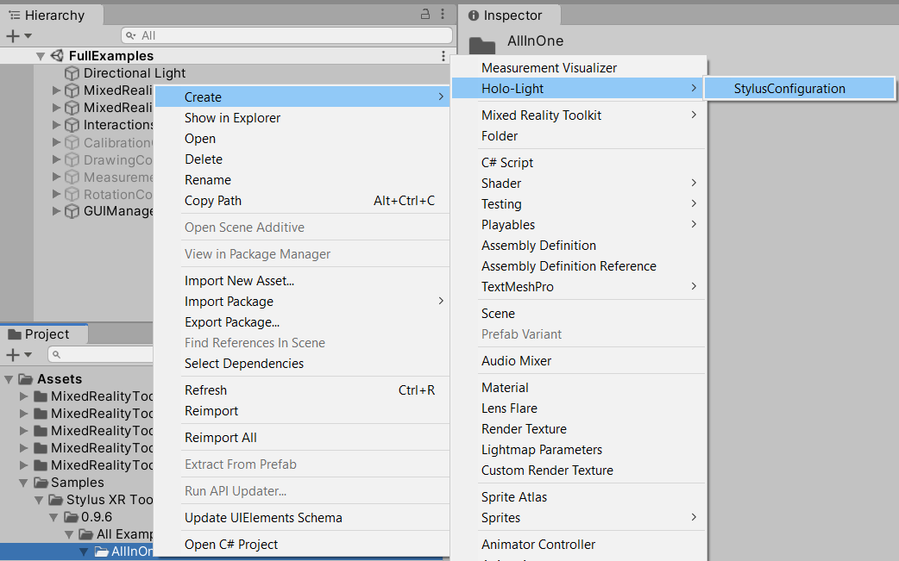
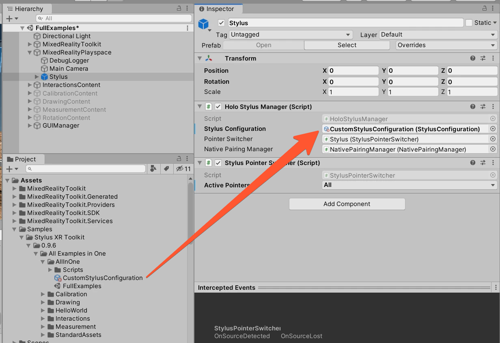
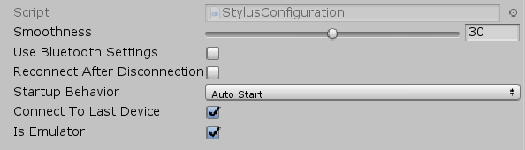

# Stylus XR Configurations

With the Stylus Configration you can configure some important behaviors. To create a custom configuration, click on **Assets → Create → Holo-Light → Stylus Configuration**.

Or Right-Click inside your Project View and follow as the next image shows.

	

To reference it to your App, you just need to click on the Stylus.prefab Instance in your scene, and change the configuration file with your custom one. 

	

When you click on the created file, it should look like this. 

	

**Smoothness** (default is **30**)

The lower the value, the smoother and slower the virtual Stylus Pointer will move. The higher the value, the faster it reacts, but too high values can cause jittering. The value can be changed during runtime, to adjust the value by needs.

**Use Bluetooth Settings** (default is **disabled**)

When this option is ticked, firstly you have to pair the HMU in the HoloLens Bluetooth Settings.

**Reconnect after Disconnection** (default is **disabled**)

When the Connection between the HoloLens and the Stylus breaks, the App will try to reconnect automatically.

**Startup Behavior** (default is **Auto Start**)

When set to Auto Start, after the App started, it will directly start searching for a HMU and connect (if a cached device is found). - Auto Start is recommended, if Stylus is the main Input Device in your App.

When set to Manual Start you have to manually call the function (HoloStylusManager.StartStylus()) which will start searching for a HMU and connect (if a cached device is found). - Manual Start is recommended, if the Stylus is an optional Input Device in your App

**IsEmulator** (default is **enabled**)

When this Option is ticked on, your Mouse will simulate the Stylus Pointer inside the UNITY EDITOR.

When it is ticked off, it will use the Bluetooth of your PC and start searching for a real Stylus. (if you get errors regarding WclGattClientDll, then copy the WclGattClientDll.dll file into your C:\Windows\System32 folder)