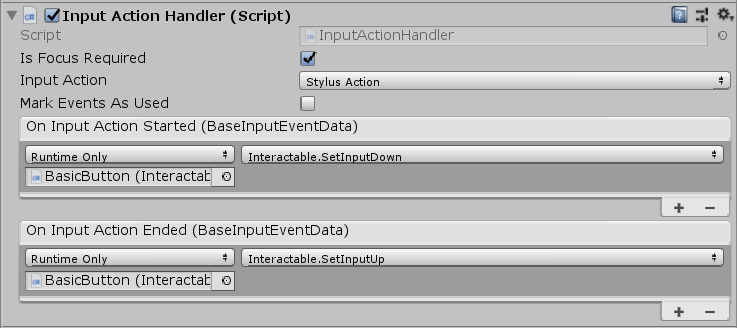
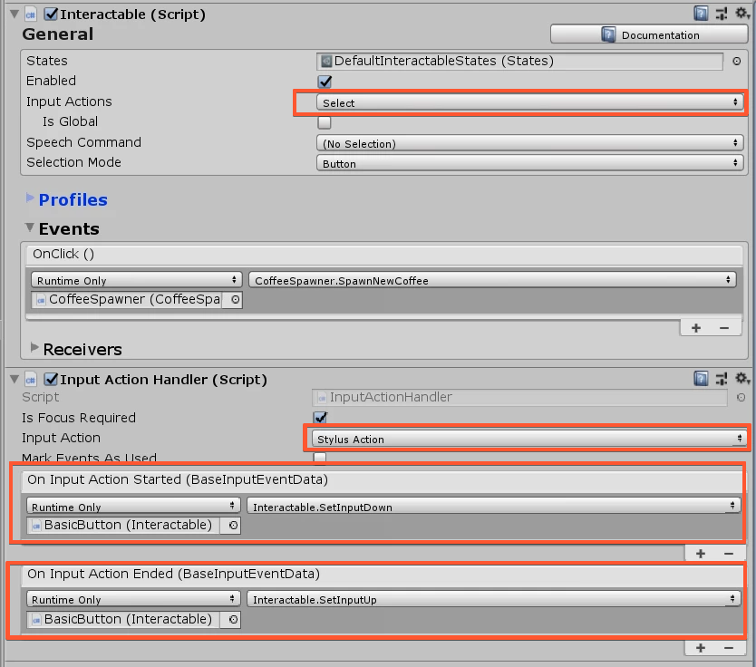

# Using Stylus XR with other Controllers (deprecated)

Beginning with STK v1.0.4 it is not needed to do this!!! The Front Button is mapped on `Select` Input Action!!! So the Stylus XR should work out of the box, when your interactables have the `Select` Input Action

In order to make the **Interactables** work with the standard Input Methods like, Gaze+Airtap, Handray, etc. in combination WITH the Stylus XR, then this guide will help you with it.

	

First we add the Component **InputActionHandler** to that GameObject, where the Interactable Component is attached to. Then we just need to select the InputAction to **Stylus Action**. Then add one event on each OnInputAction(Started/Ended) and reference the GameObject with the Interactable and choose the SetInputDown (for OnInputActionStarted) and SetInputUp (for OnInputEnded). 

In the Interactable Component, change the Input Actions to **Select**. 

> :information_source: You can find such an example in the following Scene: `FullExamples -> InteractionsContent -> SpawnCoffeeBtn`

Thats it! Now, the Button will work with Stylus XR and the other configured Input Controllers.
The result should look like this:

	

