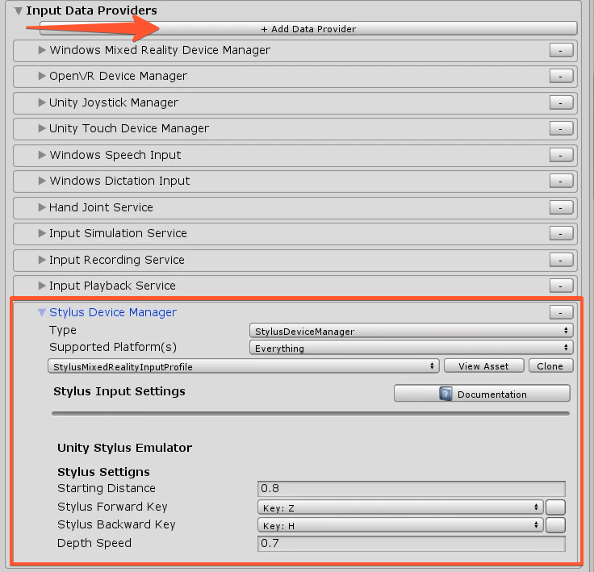
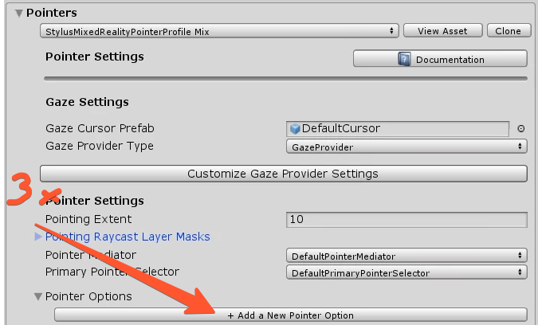
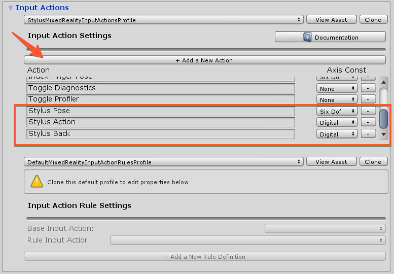
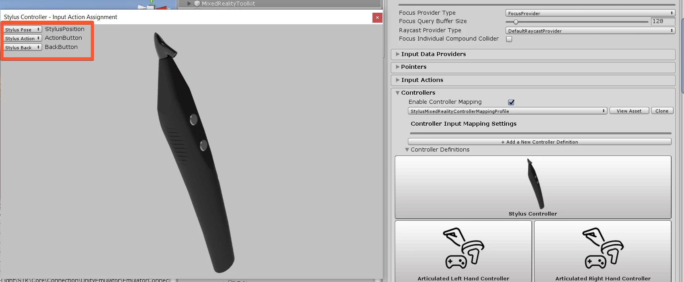

# Configuring MRTK Profiles for Stylus

In general, you should use the preconfigured Stylus Profiles. But if you want to adapt the Stylus Profile manually to adjust it to your needs, then this guide is for you. Or if you have already customized profiles and want to merge the Stylus Profile into the exisiting one.

## Input System
First select the MixedRealityToolkit GameObject in your scene and navigate to the Input Section

### Input Data Providers
`Input Data Providers -> Add Data Provider` and select the `HoloLight.STK.MRTK -> StylusDeviceManager`

	

### Input Pointers
In the Pointers Section add 3 new Pointer Options. 

	

Select the Controller Type to **Stylus**, Handeness to **Any**. Add the three Prefabs **StylusSpherePointer**, **StylusRayPointer** and **StylusPokePointer** to the Pointer Prefab field. Inside the Holo-Light/STK/MRTK/Providers/StylusInput/Pointer/ you can find there 3 prefabs. 

### Input Actions
Add 3 new Actions and Name them **Stylus Pose**, **Stylus Action** and **Stylus Back**. Stylus Pose should be set to **Six Dof**, Action and Back to **Digital**. See the picture below, how it should look like.

	

### Input Controllers
Then open Controller Definitions inside the Controllers section. There you will see **Stylus Controller**. Click on it and make sure it is configured as in the picture below.

	

