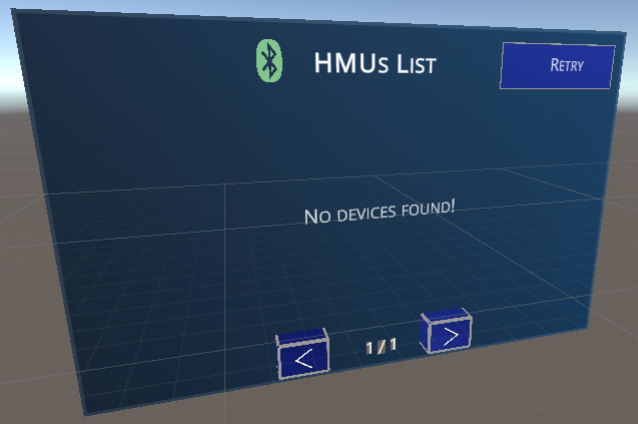
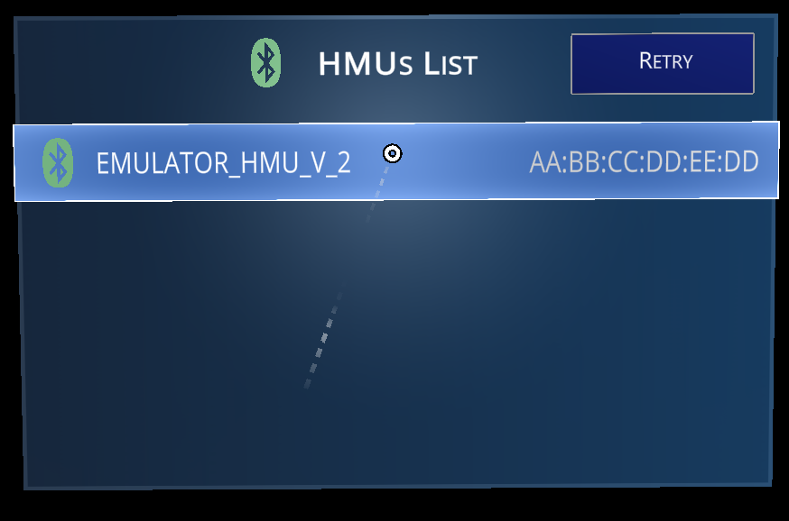

# Stylus XR User Interface

When you look inside the **Stylus** prefab, there is another prefab called **StylusUI**.
When this GameObject is in the Scene, you will get a out-of-the-box working UI Panel to list/connect to the devices.
If you want to create your own UI, have a look inside `Holo-Light/STK/Core/Connection/StylusUI.cs`. There you can see how it is made.

	
	

Basically you just need a reference to HoloStylusManager which exists only on the **Stylus** GameObject.
There you can register for different types of events to handle your UI.

* StartSearchEvent
* DeviceFoundEvent
* DeviceSearchCompleteEvent
* ConnectingStarted
* OnStylusReady
* ConnectionTimeoutEvent

...just to name a few.
 

If you don't want the default UI, and want your customized version, just remove the **StylusUI** from your scene.
