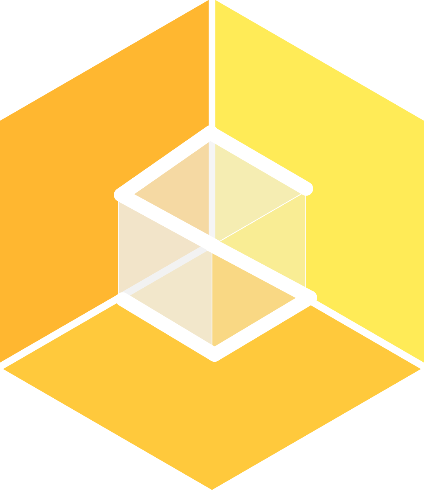

# Stylus Toolkit

## What is the Stylus Toolkit
The Stylus Toolkit is a collection of scripts and components intended to accelerate development of applications targeting the new 3D input device StylusXR for head-mounted units. Holo-Stylus works as interaction and creation tool in Mixed Reality with yet unmatched precision and was developed by HoloLight. Currently Stylus Toolkit supports the creation of Mixed Reality applications for Microsoft HoloLens with Unity 3D.

## Getting started with STK
To take advantage of StylusXR’s various capabilities, have a look at [Getting Started](Docs/GETTING_STARTED.md) that help you getting started with your first Mixed Reality Apps for StylusXR in Unity 3D.

> :white_check_mark: Fully MRTK 2.3 & 2.4 Compatible

## Docs

* [Setup Scene for Stylus](Docs/SETUP_SCENE.md)
* [Buttons & Interaction Components](Docs/BUTTONS_INTERACTIONS.md)
* [Using Stylus with other Controllers](Docs/STYLUS_CONTROLLER.md)
* [Configuring MRTK Profiles for Stylus](Docs/STYLUS_PROFILES.md)
* [Stylus Configurations](Docs/STYLUS_CONFIGS.md)
- EVENTS
	- [Connected/Disconnected](Docs/EVENTS_ONCONNECT.md)
	- [OnClick/OnHold/OnPress/...](Docs/EVENTS_ONCLICKHOLD.md)
	- [OnDoubleClick](Docs/EVENTS_ONDOUBLECLICK.md)
	- [OnInputDown/OnInputUp](Docs/EVENTS_ONINPUT.md)
- FEATURES
	- [Drawing Feature](Docs/FEATURE_DRAWING.md)
	- [Measurment Feature](Docs/FEATURE_MEASUREMENT.md)

## Example Scene

